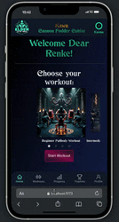

# Elder Gym Bro App

  

Welcome to the **Elder Gym Bro App** 💪🔱, your Cthulhu-themed workout companion designed to guide you through the depths of fitness with an eldritch twist. Dive into a world where physical training meets the mysterious and ancient lore of the Great Old Ones. 🐙

## Features

- **Cthulhu-Themed Workouts**: Embark on workouts inspired by the ancient and mysterious lore of Cthulhu. Each plan is crafted to challenge both your body and mind, pushing you toward legendary strength. 📜💀
- **Eldritch Tracker**: Monitor your progress with our Eldritch Tracker. Keep track of your workouts, progress, and milestones with a tracker inspired by the mythos of the Great Old Ones. 📈👁️
- **Achievements**: Unlock eldritch achievements as you reach new milestones in your fitness journey. Each achievement celebrates your progress with a touch of cosmic horror. 🏅👾

## Hosted Version

Explore the Elder Gym Bro App without the need for local setup. Visit our hosted version at [eldergymbro.netlify.app](https://eldergymbro.netlify.app/) for a fully functional experience that offers all the features of the local version. 🌐✨

## Technologies

- **Frontend**: Our user interface is built with React, providing a dynamic and responsive experience that adapts to your fitness journey. ⚛️
- **Backend**: We use Node.js and Express.js to handle server-side logic, ensuring smooth data management and application functionality. 🌐
- **Database**: MongoDB stores user data and workout plans, keeping your progress safe and secure. 💾🔒
- **Styling**: Tailwind CSS offers a customizable and mobile-first design approach, ensuring that Elder Gym Bro looks great on any device. 📱💻

## The Developers

Elder Gym Bro was brought to life by a team of developers passionate about fitness and the lore of Cthulhu. Meet the cultists behind the app:

- Michal - [GitHub](https://github.com/MichalWollny)
- Sebastian - [GitHub](https://github.com/Sebastian-Weber)
- Alex - [GitHub](https://github.com/Aero1004)
- Renke - [GitHub](https://github.com/ReynkeDeVos)

## Acknowledgments

We extend our deepest gratitude to the Great Old Ones for their eldritch inspiration and to our mentor Onur - [GitHub](https://github.com/onureredo). Join us in the Elder Gym Bro App and let the ancient powers guide you to unearthly strength! 🐙💪
